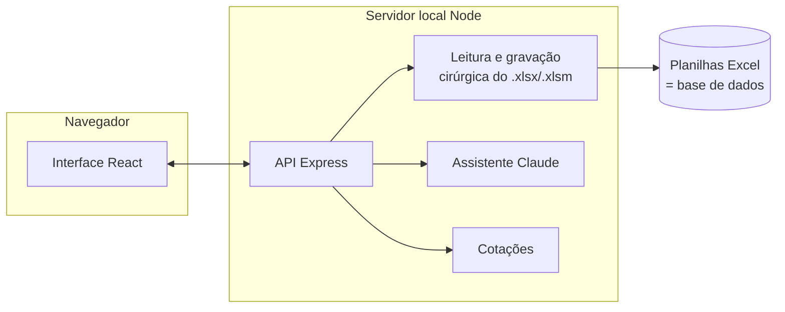
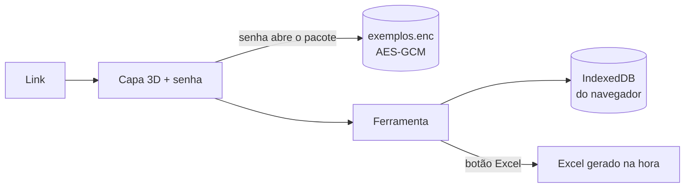

# Excelência · Orçamentos

Ferramenta web para **preencher, revisar e apresentar orçamentos de obras de arquitetura** usando as próprias planilhas Excel como base de dados, com um **assistente de IA** que ajuda a lançar cotações e levantar especificações.

> Uso interno. As planilhas reais, os orçamentos de clientes, as senhas e as chaves **não fazem parte deste repositório** (veja [Privacidade](#privacidade-e-segurança)).

---

## Sumário

- [Objetivo](#objetivo)
- [O que a ferramenta faz](#o-que-a-ferramenta-faz)
- [Como funciona](#como-funciona)
- [Regras de cálculo](#regras-de-cálculo)
- [Modelos de clientes](#modelos-de-clientes)
- [Assistente de IA](#assistente-de-ia)
- [Câmbio](#câmbio)
- [Versão online (demonstração)](#versão-online-demonstração)
- [Como rodar](#como-rodar)
- [Publicar a versão online](#publicar-a-versão-online-hugging-face-gratuito)
- [Estrutura do projeto](#estrutura-do-projeto)
- [Privacidade e segurança](#privacidade-e-segurança)
- [Limitações conhecidas e próximos passos](#limitações-conhecidas-e-próximos-passos)
- [Tecnologias](#tecnologias)

---

## Objetivo

Em projetos de arquitetura e retrofit de lojas, o orçamento é montado numa planilha Excel extensa, com hierarquia de disciplinas, grupos e itens, custos de material e mão de obra, índices de venda, administração e impostos. O trabalho sofria com quatro dores:

1. **Preenchimento manual e repetitivo.** Os preços chegam de fornecedores em PDF, foto, planilha ou mensagem e precisam ser redigitados, junto com detalhes técnicos: cores, referências, bitolas, acabamentos, marcas.
2. **Clientes com planilhas próprias.** Muitos clientes exigem o orçamento no modelo deles, que não pode ser alterado; só preenchido.
3. **Projetos internacionais.** Os valores são levantados em reais, mas às vezes precisam ser apresentados em dólar, euro ou pesos, pela cotação do dia.
4. **Apresentação ao cliente.** A planilha é ótima para calcular, mas ruim para apresentar.

A ferramenta resolve isso com uma interface guiada, **sem abandonar o Excel**. A planilha continua sendo o documento oficial e é atualizada a cada alteração.

## O que a ferramenta faz

| Área | Recursos |
|---|---|
| **Planilha (modelo da empresa)** | Estrutura em árvore (disciplina → grupo → item), edição direto nas células com teclado, sugestões de itens e especificações por disciplina, memória de cálculo (`135,4*1,2`), desfazer/refazer, gravação automática no Excel |
| **Detalhes do item** | Fornecedor, premissas ("considerado / não considerado"), especificações técnicas estruturadas, preço em qualquer moeda com conversão automática, índice individual de venda |
| **Visão geral (interna)** | Custo, venda, margem, onde está o dinheiro, curva de Pareto (itens que somam 80% do custo), material × mão de obra, alertas automáticos (itens sem preço, sem quantidade, duplicados, grupos vazios) e análise por IA |
| **Apresentação ao cliente** | Documento pronto para imprimir/PDF: investimento total, valor por m², distribuição por disciplina, composição, detalhamento e premissas/exclusões extraídas dos comentários, em qualquer moeda |
| **Modelos de clientes** | Cadastro da planilha do cliente com detecção automática da estrutura; preenchimento só das células de entrada; totais calculados com as fórmulas do próprio cliente |
| **Assistente de IA** | Lê cotações (texto, PDF, imagem, planilha), propõe lançamentos e especificações; nada é aplicado sem aprovação |
| **Câmbio** | Cotação do dia (USD, EUR, pesos argentino, chileno, mexicano, colombiano, uruguaio, guarani, sol) ou fixada manualmente |

## Como funciona



**O Excel é a base de dados.** Cada orçamento é uma pasta com o arquivo Excel e um `projeto.json` com o que a planilha não comporta: especificações estruturadas, preço original em moeda estrangeira e preferências.

**Gravação cirúrgica.** A ferramenta não regrava a planilha inteira. Ela abre o pacote do arquivo e altera **somente o XML das células de entrada**. Fórmulas, macros VBA, estilos, logotipos, validações e áreas de impressão ficam intactos. Em seguida:
- remove os valores de fórmula guardados em cache;
- descarta a cadeia de cálculo antiga;
- marca o arquivo para **recalcular ao abrir** no Excel ou no LibreOffice.

**Sincronização nos dois sentidos.** Se alguém editar o Excel por fora, a ferramenta percebe (pela data de modificação) e reimporta as mudanças, preservando o que só existe nela. Se o arquivo estiver aberto em outro programa, a gravação fica pendente e é refeita depois.

**Avisos sobre o modelo.** Ao importar, a ferramenta avisa sobre padrões suspeitos na planilha, como fórmulas que alteram valores a partir de uma data.

## Regras de cálculo

Replicam exatamente as colunas da planilha modelo (conferido centavo a centavo com orçamentos reais):

| Nível | Regra |
|---|---|
| Item (nível 4) | Unitário = material + mão de obra · Total = unitário × quantidade |
| Grupo (nível 3) | Soma dos itens |
| Disciplina / projeto (níveis 2 e 1) | Soma dos descendentes |
| Venda | Custo × (1 + BDI global) × (1 + índice individual do item) |
| Administração | Venda × % |
| Imposto (por dentro) | (Venda + Adm.) ÷ (1 − %) − (Venda + Adm.) |
| Total da proposta | Venda + Administração + Imposto |

## Modelos de clientes

Ao cadastrar a planilha de um cliente, a ferramenta:

1. **Escolhe a aba e a linha de cabeçalho** pelas palavras-chave (item, descrição/atividade, quantidade, unidade, preço unitário, total, aplicável, observações).
2. **Reconhece as seções** (códigos como `1.00` ou cabeçalhos repetidos), os **itens** e os **subtotais**.
3. **Encontra o rodapé**: a linha cujo total soma várias seções. Ali lê os **parâmetros** (taxas, percentuais, descontos) e os **resultados** (valor total, valor final).
4. **Detecta campos do cabeçalho** ("PREENCHER", "Data", "Revisão", "Construtora"…).
5. Marca como **editáveis só as células sem fórmula**. Descrições do cliente não podem ser alteradas; linhas em branco podem receber descrição.

Tudo pode ser revisado numa grade colorida (cabeçalho, seção, célula preenchível, rodapé) e ajustado à mão. Os totais na tela são calculados por um **avaliador de fórmulas próprio** (SUM, SUBTOTAL, IF, IFERROR, ROUND, MIN/MAX, SUMPRODUCT…) a partir das fórmulas do cliente. Linhas sem fórmula de total recebem quantidade × unitário.

## Assistente de IA

- **Modelo:** Claude (Anthropic), via SDK oficial, com respostas em tempo real (streaming) e *fallback* do servidor habilitado.
- **Propostas, não alterações:** a IA usa ferramentas (`propor_itens`, `propor_alteracao_item`, `propor_preenchimento_linha`…). Cada chamada vira um **cartão de proposta** que o usuário aplica ou descarta, e tudo pode ser desfeito com Ctrl+Z.
- **Entradas aceitas:** texto, PDF, imagem e planilha do fornecedor.
- **Contexto:** a cada mensagem, a IA recebe o estado atual do orçamento e as cotações do dia.
- **Análise:** na Visão geral, gera uma leitura executiva (onde está o dinheiro, riscos de escopo, oportunidades de negociação, perguntas a fazer).
- **Sem chave, sem IA:** sem chave da API o assistente fica desligado, e todo o resto funciona normalmente.

## Câmbio

- Fontes: AwesomeAPI (cotação comercial) e ExchangeRate-API como reserva.
- Cache de 10 minutos e última cotação guardada para uso offline.
- Preços podem ser digitados na moeda do fornecedor (`120 usd`, `US$ 120`, `€ 80`). O valor em reais é gravado na planilha e o original fica guardado para reconversão.

## Versão online (demonstração)

Para compartilhar um link de teste sem servidor, existe uma segunda forma de rodar a ferramenta: **inteira no navegador**, publicada como site estático.



- **Capa de acesso:** cena 3D em tempo real (Three.js) de uma galeria de boutique.
  - Materiais procedurais: mármore, pedra polida, reboco canelado, latão escovado, nogueira, veludo.
  - Reflexo no piso, oclusão de ambiente, granulação e vinheta.
  - A cena começa como desenho técnico e "acende".
  - A qualidade se ajusta sozinha ao computador e respeita a preferência "reduzir movimento".
- **Senha:** abre o pacote de exemplos criptografado (PBKDF2 + AES-256-GCM no próprio navegador). Os arquivos publicados podem ficar públicos sem expor as planilhas.
- **Dados:** cada pessoa tem os orçamentos salvos no próprio navegador (IndexedDB).
- **Excel:** gerado na hora do download, com a mesma gravação cirúrgica da versão local.
- **IA:** desligada nesta versão, porque ela exige um servidor para proteger a chave.

## Como rodar

**Requisito:** [Node.js](https://nodejs.org) 20 ou mais novo.

```bash
npm install
```

```bash
npm start
```

Abre em `http://localhost:5180`. No Windows, também dá para usar o atalho `Iniciar Ferramenta.bat`, que instala as dependências na primeira vez e abre o navegador sozinho.

Para desenvolvimento, com recarregamento automático da interface:

```bash
npm run dev
```

Abre em `http://localhost:5173` (a interface) e sobe a API na porta 5180.

### Configuração (`.env`)

Copie `.env.example` para `.env`:

| Variável | Uso |
|---|---|
| `ANTHROPIC_API_KEY` | Liga o assistente de IA (opcional) |
| `ANTHROPIC_MODEL` | Modelo usado (padrão `claude-opus-5`) |
| `EXCELENCIA_PORT` | Porta do servidor local (padrão 5180) |
| `SENHA_ACESSO` | Exige senha para abrir a ferramenta (útil se rodar num servidor) |
| `DATA_DIR` | Pasta de dados (padrão `data/`) |

### Planilhas e dados de exemplo

As planilhas reais não ficam no repositório. Para a ferramenta criar orçamentos de exemplo na primeira execução, e para `npm run verificar` e `npm run preparar-hf`, crie `exemplos.local.json` na raiz a partir de [`exemplos.example.json`](exemplos.example.json) e coloque as planilhas na mesma pasta. A **planilha modelo** usada para novos orçamentos fica em `data/modelo/Planilha modelo.xlsm`.

### Scripts

| Comando | O que faz |
|---|---|
| `npm run dev` | Interface + API em modo desenvolvimento |
| `npm start` | Compila a interface e sobe o servidor |
| `npm run verificar` | Confere as planilhas de exemplo: totais, gravação e releitura (ida e volta), preenchimento de modelo de cliente |
| `npm run preparar-hf` | Gera a pasta `hf-space/` da versão online (com os exemplos criptografados) |
| `npm run typecheck` | Checagem de tipos do projeto |

## Publicar a versão online (Hugging Face, gratuito)

1. Gere o pacote:
   ```bash
   npm run preparar-hf
   ```
   Isso cria:
   - a pasta `hf-space/`, com arquivos soltos, sem subpastas;
   - o arquivo `SENHA-HUGGINGFACE.txt`, com a senha de acesso. Ele **não** deve ser enviado.
2. Em <https://huggingface.co/new-space>, crie um Space com **SDK Static** (template *Blank*).
3. Em **Files → Add file → Upload files**, envie **os arquivos de dentro de `hf-space/`** (não a pasta) e faça o *commit*.
4. Compartilhe o link direto do Space (`https://<usuario>-<space>.static.hf.space`) e a senha.

Para atualizar, rode o comando de novo e reenvie os arquivos. A senha é mantida.

## Estrutura do projeto

```
server/                 servidor local (Node + Express)
  xlsx/workbook.ts        leitura e gravação cirúrgica do XML do Excel (macros preservadas)
  topsite.ts              modelo da empresa: leitura/gravação das abas Custo, Venda e Resumo
  clientTemplate.ts       detecção e preenchimento de planilhas de clientes
  store.ts                orçamentos e modelos em disco (Excel + projeto.json), fila de gravação
  seed.ts                 exemplos da primeira execução (local ou pacote criptografado)
  ai.ts                   assistente de IA (streaming, ferramentas → propostas)
  fx.ts                   cotações de moedas
  auth.ts                 senha de acesso opcional
shared/                 código usado pelo servidor e pelo navegador
  calc.ts                 regras de cálculo, árvore, memória de cálculo
  formula.ts              avaliador de fórmulas do Excel (subconjunto)
  catalog.ts              catálogo de disciplinas, itens típicos e campos de especificação
  summary.ts, format.ts, types.ts
src/                    interface (React + Vite)
  pages/                  página inicial, editor, detalhes do item, visão geral, apresentação, modelos
  components/             assistente, gráficos, células editáveis, câmbio, capa 3D
  lib/local/              versão online: armazenamento no navegador, tela de senha
scripts/                verificação e empacotamento da versão online
```

## Privacidade e segurança

- **Fora do repositório (via `.gitignore`):**
  - planilhas (`*.xlsx`, `*.xlsm`)
  - pasta de dados (`data/`)
  - manifesto de exemplos com nomes reais (`exemplos.local.json`)
  - pacote criptografado (`*.enc`) e pasta de publicação (`hf-space/`)
  - senha (`SENHA-HUGGINGFACE.txt`) e chaves (`.env`)
- **Chaves de API:** ficam só no servidor e nunca vão para o navegador.
- **Versão online:** os exemplos são publicados **criptografados**, e a senha nunca é publicada.
- **Assistente de IA:** só envia ao provedor de IA o conteúdo do orçamento aberto e os anexos da conversa. Nada é aplicado sem confirmação.

## Limitações conhecidas e próximos passos

- Linhas de "itens omissos" (níveis 5 e 6 do modelo) ainda não são editadas pela ferramenta.
- Modelos de clientes com colunas separadas de material e mão de obra ainda são tratados como preço unitário único.
- O avaliador de fórmulas cobre as funções mais comuns; fórmulas que referenciam outras abas aparecem como "—" na tela (o Excel calcula normalmente).
- Na versão online, os dados ficam no navegador de cada pessoa (sem compartilhamento) e a IA fica desligada.
- Ideias:
  - histórico de preços por fornecedor para comparar cotações;
  - levantamento de quantitativos a partir do projeto;
  - hospedagem com servidor para uso compartilhado.

## Tecnologias

TypeScript · React 19 · Vite · Node.js + Express · JSZip (XML do Excel) · Three.js (capa 3D) · SDK da Anthropic (Claude) · Zod · Lucide · Inter e Cormorant Garamond (fontes).
